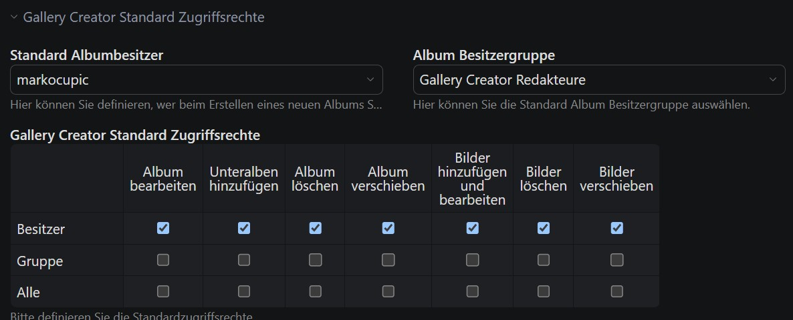

# Gallery Creator Bundle

[](https://packagist.org/packages/markocupic/gallery-creator-bundle)
[](https://packagist.org/packages/markocupic/gallery-creator-bundle)
[](https://github.com/markocupic/gallery-creator-bundle/blob/3.x/LICENSE)

**Frontend and backend extension for [Contao CMS](https://www.contao.org).**

This extension lets you create, display and manage photo albums in your
[Contao](https://www.contao.org) installation. It ships with an **album listing** and an
**album detail view**, supports nested (child) albums, per-album access rights, and
[Markdown](https://www.markdownguide.org/) album descriptions.

https://user-images.githubusercontent.com/1525166/154361326-cc4dc4c0-60c5-41e3-a0dc-a41fcd3d242e.mp4

## Table of contents

- [Requirements](#requirements)
- [Installation](#installation)
- [Upgrading](#upgrading)
- [Configuration](#configuration)
- [Access rights (CHMOD)](#access-rights-chmod)
- [Lightbox](#lightbox)
- [Styling (CSS)](#styling-css)
- [Frontend templates](#frontend-templates)
- [Extending the bundle](#extending-the-bundle)
  - [GenerateFrontendTemplateEvent](#generatefrontendtemplateevent)
  - [ImagePostInsertEvent](#imagepostinsertevent)
- [Running the tests](#running-the-tests)

## Requirements

- Contao `^5.3`
- PHP `^8.3`

## Installation

Use the **Contao Manager** or run the following command in your CLI:

```bash
composer require markocupic/gallery-creator-bundle
```

## Upgrading

> ⚠️ **Upgrading to 3.3.0?**
> This release contains **breaking changes** to the frontend Twig templates and
> **removes** the legacy `galleryCreatorGenerateFrontendTemplate` and
> `galleryCreatorImagePostInsert` hooks (replaced by Symfony events).
> Please read the [**UPGRADE.md**](UPGRADE.md) before updating, especially if you have
> customized any templates or used one of these hooks.

## Configuration

The bundle ships with a default configuration. To override it, add your settings to your
project configuration (e.g. `config/config.yaml`):

```yaml
# config/config.yaml
# Gallery Creator (default settings)
markocupic_gallery_creator:
  upload_path: 'files/gallery_creator_albums'
  copy_images_on_import: true
  read_exif_meta_data: false
  valid_extensions: ['jpg', 'jpeg', 'gif', 'png', 'webp', 'svg', 'svgz']

```

## Access rights (CHMOD)

Go to the **Contao backend settings** and select a default **album owner**, a default
**album owner group** and the default **access rights**.

**Important:** If you leave the "album owner" field empty, the currently logged-in backend
user automatically becomes the album owner when creating a new album.



## Lightbox

As a lightbox we strongly recommend [Glightbox](https://biati-digital.github.io/glightbox/):

```bash
composer require inspiredminds/contao-glightbox
```

Make sure you have activated the lightbox template in the layout settings of your theme in
the Contao backend.

## Styling (CSS)

Gallery Creator adds the `.gc-listing-view` and/or the `.gc-detail-view` class to the
`<body>` tag. This helps you show or hide items depending on the current mode (listing vs.
detail view).

```scss
// SASS: do not display the content element headline in detail mode
body.gc-detail-view {
  .ce_gallery_creator {
    h2:not([class^="gc-album-detail-name"]) {
      display: none;
    }
  }
}
```

## Frontend templates

The frontend output is rendered with Contao Twig components. You can override any of the
shipped templates in your project's `contao/templates/` directory:

- `content_element/gallery_creator.html.twig`
- `content_element/gallery_creator_news.html.twig`
- `component/_album.html.twig`
- `component/_album_detail_view.html.twig`
- `component/_album_list_view.html.twig`

> If you override these templates, be aware that the template variables changed in 3.3.0.
> See [UPGRADE.md](UPGRADE.md) for the details.

## Extending the bundle

### GenerateFrontendTemplateEvent

Use the `GenerateFrontendTemplateEvent` to adapt the frontend output. It is dispatched
right before the gallery frontend template is rendered and carries the content element
controller, the template, the current request and the active album (if there is one).
Listeners mutate the template in place; no return value is expected.

> This replaces the in version 3.0.0 removed `galleryCreatorGenerateFrontendTemplate` hook (see
> [UPGRADE.md](UPGRADE.md)).

```php
<?php
// src/EventListener/GalleryCreatorFrontendTemplateListener.php
declare(strict_types=1);

namespace App\EventListener;

use Markocupic\GalleryCreatorBundle\Event\GenerateFrontendTemplateEvent;
use Symfony\Component\EventDispatcher\Attribute\AsEventListener;

#[AsEventListener(priority: 100)]
class GalleryCreatorFrontendTemplateListener
{
    public function __invoke(GenerateFrontendTemplateEvent $event): void
    {
        $template = $event->getTemplate();
        $activeAlbum = $event->getAlbumsModel();
        $contentElement = $event->getContentElement();
        $request = $event->getRequest();

        $template->set('foo', 'bar');
    }
}
```

### ImagePostInsertEvent

Use the `ImagePostInsertEvent` to adapt the picture entity when uploading new images to an
album. It is dispatched right after an image has been uploaded and written to the database
and carries the pictures model. Listeners mutate the model in place; no return value is
expected.

> This replaces the in version 3.0.0 removed `galleryCreatorImagePostInsert` hook (see [UPGRADE.md](UPGRADE.md)).

```php
<?php
// src/EventListener/GalleryCreatorImagePostInsertListener.php
declare(strict_types=1);

namespace App\EventListener;

use Contao\BackendUser;
use Markocupic\GalleryCreatorBundle\Event\ImagePostInsertEvent;
use Symfony\Bundle\SecurityBundle\Security;
use Symfony\Component\EventDispatcher\Attribute\AsEventListener;

#[AsEventListener(priority: 100)]
class GalleryCreatorImagePostInsertListener
{
    public function __construct(private readonly Security $security)
    {
    }

    public function __invoke(ImagePostInsertEvent $event): void
    {
        $picturesModel = $event->getPicturesModel();
        $user = $this->security->getUser();

        // Automatically add a caption to the uploaded image
        if ($user instanceof BackendUser && $user->name) {
            $picturesModel->caption = 'Holidays '.date('Y').', Photo: '.$user->name;
            $picturesModel->save();
        }
    }
}
```

Have fun!
